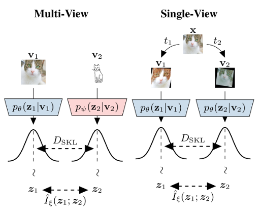
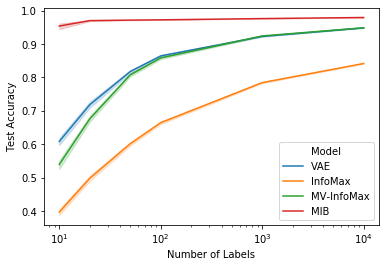

# Learning Robust Representations via Multi-View Information Bottleneck

PyTorch implementation of the Multi-View Information Bottleneck (MIB) model from "Learning Robust Representations via Multi-View Information Bottleneck".



Please read [our paper](https://arxiv.org/abs/2002.07017) for a more detailed description of the training procedure.

### Bibtex
Please use the following bibtex for citations:
```latex
@inproceedings{federici2020,
title={Learning Robust Representations via Multi-View Information Bottleneck},
author={Marco Federici and Anjan Dutta and Patrick Forré and Nate Kushman and Zeynep Akata},
booktitle={International Conference on Learning Representations},
year={2020}
}
```

## Installing
The conda and pip dependencies required to run our code are specified in the `environment.yml` environment file and can be installed by running
```shell script
conda env create -f environment.yml
```
Activate the environment
```shell script
conda activate mib
```

## Training
This project provides code to train and evaluate different architectures in unsupervised/self-supervised settings.
Each training procedure is described by a `.yml' file which specifies loss function and the value for the 
respective hyper-parameters.

### Training from scratch
In order to train a model starting from a random weight initialization, use
```shell script
python train_representation.py <EXPERIMENT_FOLDER> --config-file=<CONFIG_FILE>
```
Where `<EXPERIMENT_FOLDER>` refers to the directory in which model checkpoints and training log will be stored, while `<CONFIG_FILE>`
must refer to a valid training configuration file in which the training procedure is specified together with its hyperparameters.

In this project, the configuration files and code to train the following models have been included:

- Variational Autoencoders (VAE) `configs/VAE.yml`

- InfoMax `configs/InfoMax.yml`
 
- Multi-View InfoMax (MV-InfoMax) `configs/MV_InfoMax.yml`

- Multi-View Information Bottleneck (MIB) `configs/MIB.yml`

In order to train a MIB model and store checkpoints and logs in the directory `experiments/MIB` 
, the following command can be used:
```shell script
python train_representation.py experiments/MIB --config-file=configs/MIB.yml
``` 

Additional flags can be used to specify other hyper-parameters such as number of training epochs, batch size and device used for training (`cuda` or `cpu`).
An extensive description of the training options can by accessed by using the `--help` flag
```shell script
python train_representation.py --help
```

### Resuming training from a checkpoint
To resume the training from the last available checkpoint use:
```shell script
python train_representation.py <EXPERIMENT_FOLDER>
```
Where `<EXPERIMENT_FOLDER>` must refer to the same directory containing checkpoint and configuration files created by 
first running `train_representation.py` using the `--config-file` argument.

### Logging
Logs regarding different components of the optimized objectives and performance of a classifier trained on a subset of the training representations
and evaluated on the test set can be visualized using [Tensorboard](https://www.tensorflow.org/tensorboard). This can be done by typing:
```shell script
tensorboard --logdir=<EXPERIMENT_FOLDER>
```
Where `<EXPERIMENT_FOLDER>` refers to the path to a previously start experiment

## Results and Visualizations
The `results.ipynb` notebook provides some simple code to visualize and evaluate the quality of the different representations.


Examples of encoders trained using the VAE, InfoMax, MV-InfoMax and MIB objective can be found and loaded form the `trained_models` folder.

